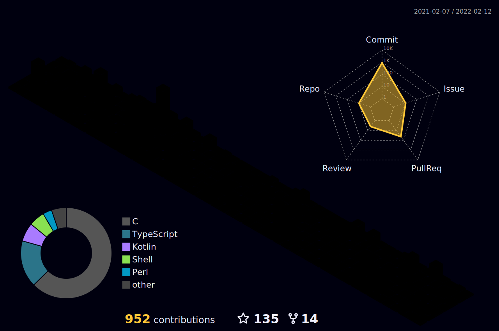

<h1 align="center">
  
  𝐇𝐞𝐥𝐥𝐨, &lt;World/&gt;!
  
  
</h1>

<br/>
<br/>


<h3 align="center">
  hi, I am Chuluo
  
</h3>
- 👦 I am a teenager from China, and I started my programming journey in 2022.<br/>
- 🖥️ At the age of 15, I had my own computer.<br/>
- 📚 I am still constantly learning knowledge now.<br/>
- 🔭 The skills mastered include programming, music, drawing, game development, 3D modeling, and animation production<br/>
- 😄 𝙿𝚛𝚘𝚗𝚘𝚞𝚗𝚜 : 𝙷𝚎/𝙷𝚒𝚖/𝙷𝚒𝚜.
<br/>
<br/>
<p align="center">
   •   
<!--   <a href="https://user-badge.committers.top/india_private/JayantGoel001"></a> • -->
   •
   •
  <a href="https://github.com/sponsors/chuluo0"></a>
</p>
#

<details open="">
<summary>
  <g-emoji class="g-emoji" alias="chart_with_upwards_trend" fallback-src="https://github.githubassets.com/images/icons/emoji/unicode/1f4c8.png">📈</g-emoji>
  <strong>𝙶𝚒𝚝𝚑𝚞𝚋 𝚂𝚝𝚊𝚝𝚜 : </strong>
</summary>
<br/>

<p align="center">
    
    
</p>
</details>
<br/>




<h4 align="center">
  
```diff
+@ @ @ @ @ @ @ @ @ @ @ @ @ @ @ @ @ @ @ @ @ @ @ @ @ @ @ @+
@@       o o                                           @@
@@       | |                                           @@
@@      _L_L_                                          @@
@@   ❮\/__-__\/❯ Programming isn't about what you know @@
@@   ❮(|~o.o~|)❯  It's about what you can figure out   @@
@@   ❮/ \`-'/ \❯                                       @@
@@     _/`U'\_                                         @@
@@    ( .   . )     .----------------------------.     @@
@@   / /     \ \    | while( ! (succeed=try() ) ) |     @@
@@   \ |  ,  | /    '----------------------------'     @@
@@    \|=====|/                                        @@
@@     |_.^._|                                         @@
@@     | |"| |                                         @@
@@     ( ) ( )   Testing leads to failure              @@
@@     |_| |_|   and failure leads to understanding    @@
@@ _.-' _j L_ '-._                                     @@
@@(___.'     '.___)                                    @@
+@ @ @ @ @ @ @ @ @ @ @ @ @ @ @ @ @ @ @ @ @ @ @ @ @ @ @ @+
```

</h4> 

<br/>
<br/>
<h3>我的编程世界就像武侠世界一样精彩而绚烂，每一次进步都像是掌握了一门武功</h3>


<br/>


